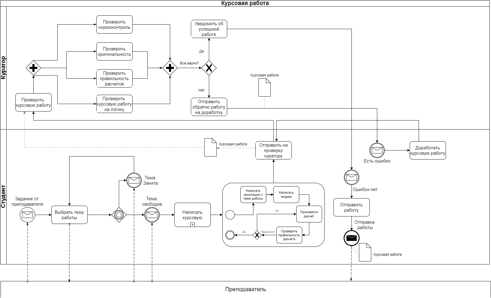

# Итоговая работа

## Моделирование БП

### Задание
По аналогии с предыдущими заданиями из домашних работ модуля (см. Домашнее задания занятий по темам “Моделирование БП BPMN 2.0” и “Моделирование бизнес-процессов в нотациях IDEF0, IDEF3”) необходимо:

Подробно нарисовать один из предложенных процессов на выбор:

a. Оформление путевки в туристическом агентстве;

b. Заказ пошива одежды в ателье;

c. Написание курсовой работы в университете.

Верхнеуровневый процесс необходимо нарисовать в нотации IDEF0.

Детализацию процесса необходимо оформить в BPMN 2.0 в виде диаграммы взаимодействия.

На схеме обязательно должны присутствовать:

a. Минимум один детализированный подпроцесс;

b. Не менее трех видов промежуточных событий;

c. Не менее двух дорожек в пуле основного процесса;

d. Не менее 10 действий.

Полученный результат (в любом формате на выбор: pdf, png или jpeg) загрузить в личный кабинет.

